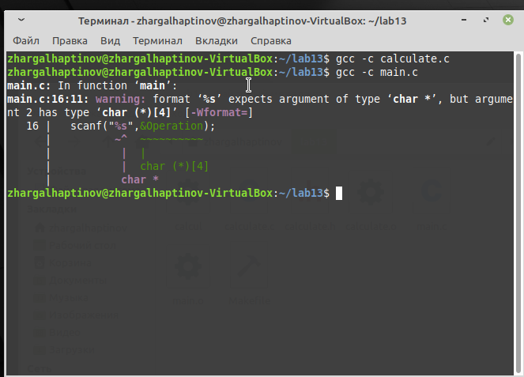
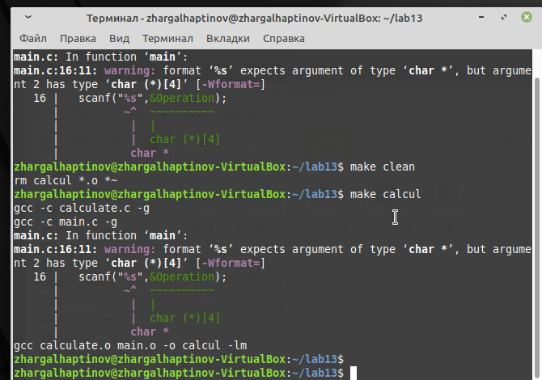
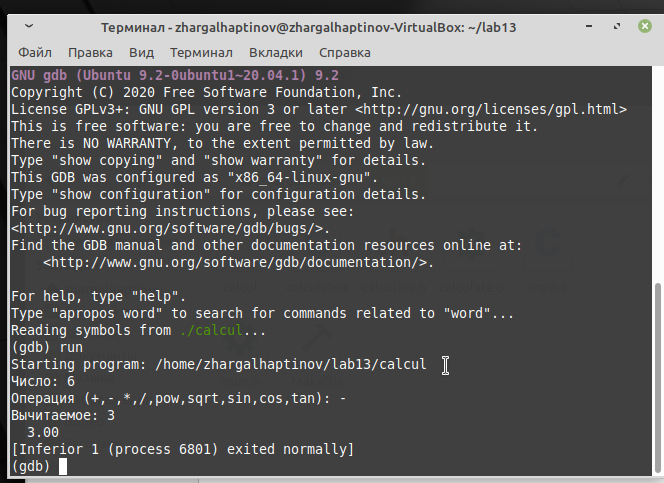
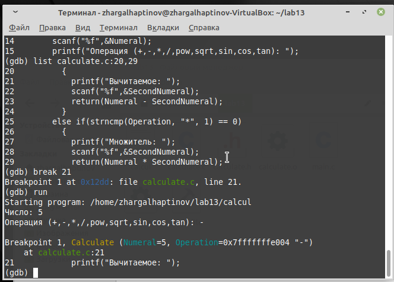
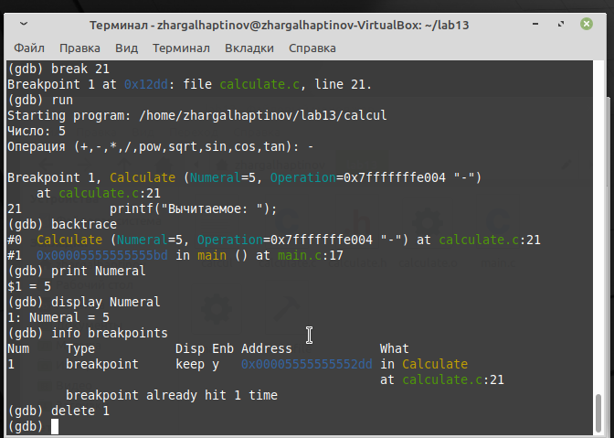
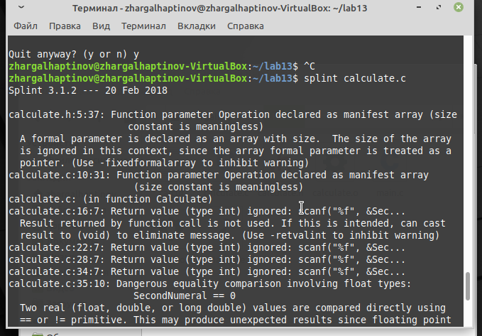

---
## Front matter
lang: ru-RU
title:  Средства для создания приложений в ОС UNIX.
author: |
	 Хаптинов Жаргал Владимирович НПИбд-02-21\inst{1}

institute: |
	\inst{1}Российский Университет Дружбы Народов

date: 10 июня, 2022, Москва, Россия

## Formatting
mainfont: PT Serif
romanfont: PT Serif
sansfont: PT Sans
monofont: PT Mono
toc: false
slide_level: 2
theme: metropolis
header-includes: 
 - \metroset{progressbar=frametitle,sectionpage=progressbar,numbering=fraction}
 - '\makeatletter'
 - '\beamer@ignorenonframefalse'
 - '\makeatother'
aspectratio: 43
section-titles: true

---

# Цели и задачи работы

## Цель лабораторной работы

Приобрести простейшие навыки разработки, анализа, тестирования и отладки приложений в ОС типа UNIX/Linux на примере создания на языке программирования С калькулятора с простейшими функциями.

## Задачи лабораторной работы

1 Написать код приложения

2 Выполнить компиляцию

3 Подготовить Makefile

4 Выполнить отладку в GDB

5 Проанализировать код при помощи splint

# Процесс выполнения лабораторной работы

## Выполнение работы

{ #fig:001 width=70% }

## Выполнение работы

{ #fig:002 width=70% }

## Выполнение работы

{ #fig:003 width=70% }

## Выполнение работы

{ #fig:004 width=70% }

## Выполнение работы

{ #fig:005 width=70% }

## Выполнение работы

{ #fig:006 width=70% }

# Выводы по проделанной работе

## Вывод

Приобрели простейшие навыки разработки, анализа, тестирования и отладки приложений в ОС типа UNIX/Linux на примере создания на языке программирования С калькулятора с простейшими функциями.