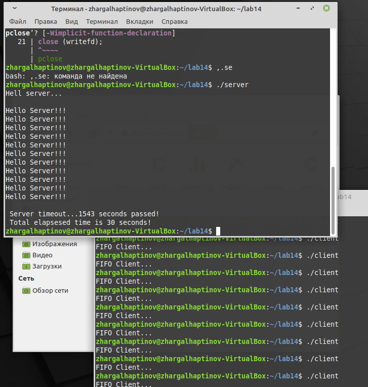

---
## Front matter
lang: ru-RU
title:  Средства для создания приложений в ОС UNIX.
author: |
	 Хаптинов Жаргал Владимирович НПИбд-02-21\inst{1}

institute: |
	\inst{1}Российский Университет Дружбы Народов

date: 10 июня, 2022, Москва, Россия

## Formatting
mainfont: PT Serif
romanfont: PT Serif
sansfont: PT Sans
monofont: PT Mono
toc: false
slide_level: 2
theme: metropolis
header-includes: 
 - \metroset{progressbar=frametitle,sectionpage=progressbar,numbering=fraction}
 - '\makeatletter'
 - '\beamer@ignorenonframefalse'
 - '\makeatother'
aspectratio: 43
section-titles: true

---

# Цели и задачи работы

## Цель лабораторной работы

Приобретение практических навыков работы с именованными каналами.

## Задачи лабораторной работы

1 Написать код приложения

# Процесс выполнения лабораторной работы

## Выполнение работы

Пишем и редактируем программы на С, так чтобы на одном сервере можно было запускать сначала один клиент.

Далее напишем и отредактируем программы, так чтобы на одном сервере можно было запускать больше серверов, чем один, интервал между клиентами будет 5 секунд, сервер завершится через 30 секунд.

Мы имеем 4 файла (программы) это заголовочный файл (common.h) клиент (client.c), сервер (server.c), и Makefile. 

## Выполнение работы

{ #fig:001 width=70% }

# Выводы по проделанной работе

## Вывод

В данной работе мы приобрели практические навыки работы с именованными каналами по типу клиент-сервер. 