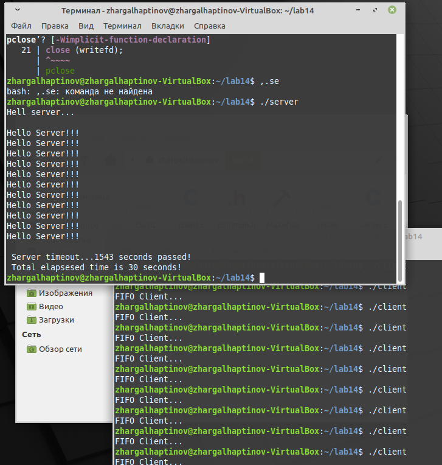

---
# Front matter
lang: ru-RU
title: "Отчёт по лабораторной работе №14"
subtitle: "Именованные каналы"
author: "Хаптинов Жаргал Владимирович НПИбд-02-21"

# Formatting
toc-title: "Содержание"
toc: true # Table of contents
toc_depth: 2
lof: true # List of figures
fontsize: 12pt
linestretch: 1.5
papersize: a4paper
documentclass: scrreprt
polyglossia-lang: russian
polyglossia-otherlangs: english
mainfont: PT Serif
romanfont: PT Serif
sansfont: PT Sans
monofont: PT Mono
mainfontoptions: Ligatures=TeX
romanfontoptions: Ligatures=TeX
sansfontoptions: Ligatures=TeX,Scale=MatchLowercase
monofontoptions: Scale=MatchLowercase
indent: true
pdf-engine: lualatex
header-includes:
  - \linepenalty=10 # the penalty added to the badness of each line within a paragraph (no associated penalty node) Increasing the value makes tex try to have fewer lines in the paragraph.
  - \interlinepenalty=0 # value of the penalty (node) added after each line of a paragraph.
  - \hyphenpenalty=50 # the penalty for line breaking at an automatically inserted hyphen
  - \exhyphenpenalty=50 # the penalty for line breaking at an explicit hyphen
  - \binoppenalty=700 # the penalty for breaking a line at a binary operator
  - \relpenalty=500 # the penalty for breaking a line at a relation
  - \clubpenalty=150 # extra penalty for breaking after first line of a paragraph
  - \widowpenalty=150 # extra penalty for breaking before last line of a paragraph
  - \displaywidowpenalty=50 # extra penalty for breaking before last line before a display math
  - \brokenpenalty=100 # extra penalty for page breaking after a hyphenated line
  - \predisplaypenalty=10000 # penalty for breaking before a display
  - \postdisplaypenalty=0 # penalty for breaking after a display
  - \floatingpenalty = 20000 # penalty for splitting an insertion (can only be split footnote in standard LaTeX)
  - \raggedbottom # or \flushbottom
  - \usepackage{float} # keep figures where there are in the text
  - \floatplacement{figure}{H} # keep figures where there are in the text
---

# Цель работы

Приобретение практических навыков работы с именованными каналами.

# Выполнение лабораторной работы

Пишем и редактируем программы на С, так чтобы на одном сервере можно было запускать сначала один клиент.
Далее напишем и отредактируем программы, так чтобы на одном сервере можно было запускать больше серверов, чем один, интервал между клиентами будет 5 секунд, сервер завершится через 30 секунд.
Мы имеем 4 файла (программы) это заголовочный файл (common.h) клиент (client.c), сервер (server.c), и Makefile. 

```
////////////////////////////////////
// common.h
#ifndef __COMMON_H__
#define __COMMON_H__
#include <stdio.h>
#include <stdlib.h>
#include <string.h>
#include <errno.h>
#include <sys/types.h>
#include <sys/stat.h>
#include <fcntl.h>
#define FIFO_NAME "/tmp/fifo"
#define MAX_BUFF 80
#endif /* __COMMON_H__ */
```

```
////////////////////////////////////
// client.c
#include "common.h"
#define MESSAGE "Hello Server!!! \n"
int main ()
{
int writefd; 
int msglen;
printf("FIFO Client...\n");
if ((writefd = open(FIFO_NAME, O_WRONLY)) < 0)
{
fprintf(stderr, "%s: Невозможно открыть FIFO (%s)\n",
__FILE__, strerror(errno));
exit(-1);
}
msglen = strlen(MESSAGE);
if (write(writefd, MESSAGE, msglen) != msglen)
{
fprintf(stderr, "%s: Ошибка записи в FIFO (%s)\n",
__FILE__, strerror(errno));
exit(-2);
}
close (writefd);
exit(0);
} 
```

```
////////////////////////////////////
// server.c
#include "common.h"
void display() {
	printf("/n Server timeout...%u seconds passed!\n Total elapsesed time is 30 seconds!\n",clock());
}
int main()
{
clock_t start, now;
start = time(NULL);
int readfd;
int n;
char buff[MAX_BUFF];
printf("Hell server...\n\n");
if(mknod(FIFO_NAME, S_IFIFO | 0666, 0) < 0)
{
fprintf(stderr, "%s: Unable to create FiFO(%s)\n", __FILE__, strerror(errno));
exit(-1);
}
if((readfd = open(FIFO_NAME, O_RDONLY)) < 0)
{
fprintf(stderr, "%s: Unable to open FIFO (%s)\n", __FILE__, strerror(errno));
exit(-2);
}
for(;;)
{
while((n = read(readfd, buff, MAX_BUFF)) > 0)
{
if(write(1, buff, n) != n)
{
fprintf(stderr, "%s: Input error (%s)\n", __FILE__, strerror(errno));
}
sleep(5);
}
now=time(NULL);
if (now-start>30)
{
display();
return 0;
}
}
close(readfd); 
if(unlink(FIFO_NAME) < 0)
{
fprintf(stderr, "%s: unable to delete FIFO (%s)\n", __FILE__, strerror(errno)); 
exit(-4);
}
exit(0);
}
```

```
////////////////////////////////////
// makefile
all: server client
server: server.c common.h
	gcc server.c -o server
client: client.c common.h
	gcc client.c -o client
clean:
	-rm server client *.o
```

Запуск пректа

{ #fig:001 width=70% }

# Вывод

 В данной работе мы приобрели практические навыки работы с именованными каналами по типу клиент-сервер. 
 
# Контрольные вопросы

1. В чем ключевое отличие именованных каналов от неименованных?
Ответ: У именованных каналов есть идентификатора канала, а у неименованных его нет.

2. Возможно ли создание неименованного канала из командной строки?
Ответ: Возможно создание неименованного канала из командной строки, но только с созданием временного канала с индикатором.

3. Возможно ли создание именованного канала из командной строки?
Ответ: Да. При помощи mknod.

4. Опишите функцию языка С, создающую неименованный канал.
Ответ:
```
#include int fd[2]; 
pipe(fd); 
/* возвращает 0 в случае успешного завершения, -1 - в случае ошибки;*/ 
Это значит, что функция возвращает два файловых дескриптора: fd[0] и fd[l], при этом первый открыт для чтения, а второй – для записи.
```

5. Опишите функцию языка С, создающую именованный канал.
Ответ: 
```
#include <sys/types.h> 
#include <sys/stat.h> 
int mkfifo(const char *pathname, mode_t mode);
```

6. . Что будет в случае прочтения из fifo меньшего числа байтов, чем находится в канале? Большего числа байтов?
Ответ: 
При чтении меньшего числа байтов, чем находится в канале или FIFO, возвращается требуемое число байтов, остаток сохраняется для последующих чтений. При чтении большего числа байтов, чем находится в канале или FIFO, возвращается доступное число байтов. Процесс, читающий из канала, должен соответствующим образом обработать ситуацию, когда прочитано меньше, чем требуется в программе.

7. Аналогично, что будет в случае записи в fifo меньшего числа байтов, чем позволяет буфер? Большего числа байтов?
Ответ: Запись числа байтов, меньшего числа битов у канала или FIFO, в случае, когда несколько процессов одновременно записывают в канал, порции данных от этих процессов не перемешиваются. При записи большего числа байтов, чем это позволяет канал или FIFO, вызов write(2) блокируется до освобождения занятой нами до этого памяти.

8. Могут ли два и более процессов читать или записывать в канал?
Ответ: Да. Если у buff достаточное количество памяти.

9. Опишите функцию write (тип возвращаемого значения, аргументы и логику работы). Что означает 1 (единица) в вызове этой функции в программе server.c (строка 42)?
Ответ: Функция записывает length памяти из буфера buffer в файл, определенный дескриптором файла fd. Эта операция чисто 'двоичная' и без буферизации. При единице возвращает действительное число байтов. При  -1 сообщение об ошибке.

10.  Опишите функцию strerror
Ответ: Интерпретирует номер ошибки, передаваемый в функцию в качестве аргумента — errornum, в понятное для человека текстовое сообщение (строку). Откуда берутся эти ошибки? Ошибки эти возникают при вызове функций стандартных Си-библиотек. То есть хорошим тоном программирования будет — использование этой функции в паре с другой, и если возникнет ошибка, то пользователь или программист поймет, как исправить ошибку, прочитав сообщение функции strerror.
Возвращенный указатель ссылается на статическую строку с ошибкой, которая не должна быть изменена программой. Дальнейшие вызовы функции strerror перезапишут содержание этой строки. Интерпретированные сообщения об ошибках могут различаться, это зависит от платформы и компилятора.